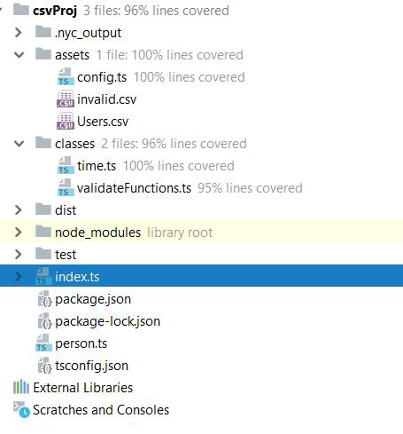

# csv-parser 

### This project parses csv file, stores valid data in DataBase (MySQL) and invalid files in another csv file. 

Usage: 

- clone this repo locally 
- npm install 
- create mysql database called 'persons' and run it 
- run index.ts 

Testing: 

- npm test 
- npm run coverage 

Example of test coverage report:

